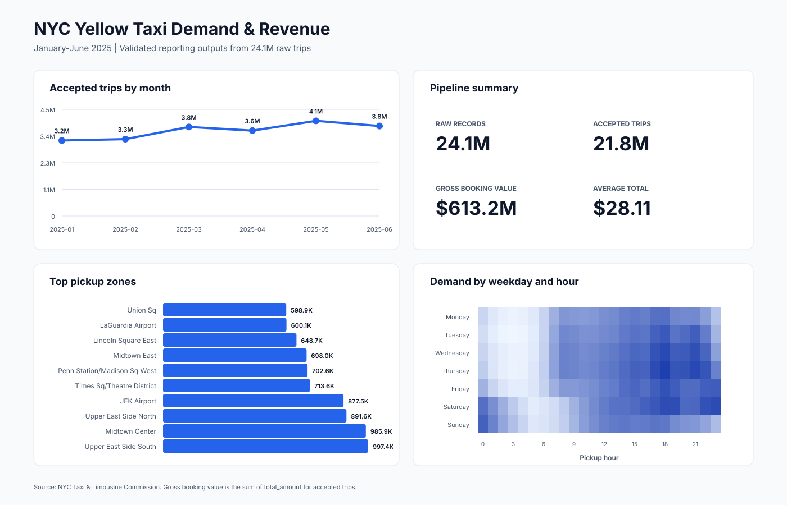

# NYC Yellow Taxi Demand & Reporting Pipeline

[](https://github.com/masarcode/nyc-taxi-demand-analysis/actions/workflows/tests.yml)

**When and where is Yellow Taxi demand concentrated, and how can a large trip
dataset be converted into reliable operational reporting?**

This project processes **24,083,384 official NYC Taxi & Limousine Commission
trip records** from January through June 2025. A row-group Python ETL pipeline
validates the trips without loading the full dataset into memory, retains
**21,810,780 accepted records**, and produces eight analysis-ready reporting
tables for BigQuery or another BI layer.



## Executive findings

- **May had the highest accepted volume:** 4,054,716 trips.
- **Evening demand is consistently important:** Thursday at 6 p.m. was the
  largest recurring weekday-hour combination, with 246,805 accepted trips.
- **Upper East Side South led pickup volume:** 997,406 accepted pickups,
  followed by Midtown Center at 985,871.
- **The leading high-volume route was local:** Upper East Side South to Upper
  East Side North recorded 146,707 trips, averaging 7.28 minutes and $15.72 in
  total charges.
- Accepted trips represented **$613.2 million in gross booking value**, with
  an average `total_amount` of **$28.11**. Gross booking value is not profit or
  net operator revenue.

These patterns support concentrating fleet availability around high-volume
Manhattan zones and evening demand windows, while airport zones remain
important distinct operating markets. The results describe completed rides;
they do not measure unserved demand or prove that repositioning alone would
increase revenue.

## Pipeline design


The original prototype failed while appending Parquet row groups whose inferred
integer types differed. The repaired pipeline supplies a canonical Arrow
schema and can optionally write stable cleaned monthly partitions.

## Data-quality results

| Measure | Result |
| --- | ---: |
| Raw trip records | 24,083,384 |
| Accepted trips | 21,810,780 |
| Rejected trips | 2,272,604 |
| Acceptance rate | 90.56% |
| Reporting tables | 8 |

Each rejected row is assigned exactly one first-failing reason. The largest
categories were invalid or nonpositive fares, invalid distances, and invalid
durations. Complete month-level counts are preserved in
[`data_quality_summary.csv`](outputs/tables/data_quality_summary.csv).

## Reporting model

The pipeline creates:

1. `monthly_summary`
2. `daily_demand`
3. `hourly_demand`
4. `pickup_zone_summary`
5. `route_summary`
6. `distance_band_summary`
7. `payment_summary`
8. `data_quality_summary`

See the [data dictionary](docs/data_dictionary.md) for table grain and metric
definitions. The optional BigQuery loader creates these as eight native tables
using Google Application Default Credentials; no credential files belong in
the repository.

## Reproduce the analysis

Create a Python 3.11+ environment:

```bash
python -m venv .venv
source .venv/bin/activate
python -m pip install -r requirements.txt
```

Download the configured TLC partitions and taxi-zone lookup:

```bash
python scripts/download_data.py
```

Run the row-group pipeline:

```bash
python -m nyc_taxi_pipeline.pipeline \
  data/raw/yellow_tripdata_2025-0[1-6].parquet \
  --zone-lookup data/raw/taxi_zone_lookup.csv \
  --output-dir outputs/tables
```

Regenerate the dashboard preview:

```bash
python scripts/render_dashboard.py
```

Run the tests:

```bash
python -m pytest tests -q
```

To load the eight generated tables into BigQuery, install the cloud extra and
use your own project and dataset:

```bash
python -m pip install -r requirements-cloud.txt
python scripts/load_bigquery.py --project YOUR_PROJECT_ID --dataset taxi_reporting
```

## Repository structure

```text
config/                  source partitions and pipeline configuration
data/raw/                downloaded TLC files; excluded from Git
docs/                    methodology, limitations, and data dictionary
outputs/figures/         reproducible portfolio dashboard
outputs/tables/          eight analysis-ready reporting tables
scripts/                 acquisition, BigQuery loading, and visualization
sql/                     documented business queries
src/nyc_taxi_pipeline/   row-group cleaning and aggregation pipeline
tests/                   schema, validation, and output tests
```

## Sources

- [NYC TLC Trip Record Data](https://www.nyc.gov/site/tlc/about/tlc-trip-record-data.page)
- [Yellow Taxi January 2025 Parquet](https://d37ci6vzurychx.cloudfront.net/trip-data/yellow_tripdata_2025-01.parquet)
- [NYC TLC Taxi Zone Lookup](https://d37ci6vzurychx.cloudfront.net/misc/taxi_zone_lookup.csv)
- [Source manifest with verified partition row counts](docs/source_manifest.csv)
- [Methodology and limitations](docs/methodology.md)

## Tech stack

**Python, pandas, NumPy, PyArrow, Parquet, SQL, BigQuery, SVG, pytest,
GitHub Actions**

## Scope note

This is an independent portfolio analysis using public data. It is not
affiliated with the NYC Taxi & Limousine Commission. The committed aggregate
tables can be reproduced from the public monthly files; raw trip data is not
duplicated in this repository.
